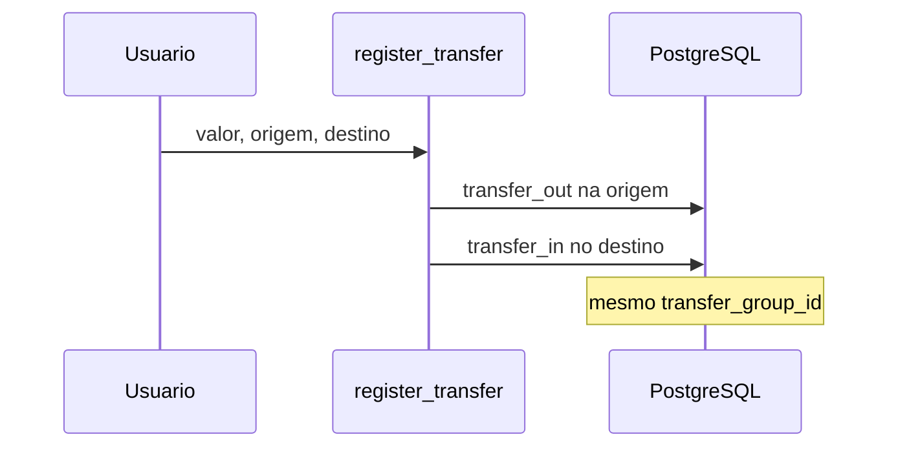

# Arquitetura — AssistFin

## Visão geral

```
┌─────────────┐     HTMX      ┌──────────────┐
│  Browser    │◄────────────►│  pages.py    │
│  (Jinja2)   │              │  auth.py     │
└─────────────┘              └──────┬───────┘
                                    │
                    ┌───────────────┼───────────────┐
                    ▼               ▼               ▼
             ┌──────────┐   ┌──────────┐   ┌──────────┐
             │ finance  │   │ runner   │   │ admin    │
             │ .py      │   │ (agent)  │   │          │
             └────┬─────┘   └────┬─────┘   └──────────┘
                  │              │
                  ▼              ▼
             ┌─────────────────────────┐
             │   PostgreSQL (app2-db)   │
             └─────────────────────────┘
                                    │
                              ┌─────▼─────┐
                              │ Groq API  │
                              │ Ollama    │
                              └───────────┘
```

## Camadas

### Apresentação

- Templates Jinja2 com Tailwind CDN
- HTMX para chat do assistente e confirmações sem reload completo
- Sidebar: Dashboard, Contas, Movimentos, Orçamentos, Admin (root)
- **Movimentos** (`/transactions`): duas seções — **A realizar** (previstos pendentes) e **Extrato** (realizados); formulário manual alinhado ao wizard (datas conforme status)

### API / rotas

- `routers/pages.py` — HTML (dashboard, movimentos, agente)
- `routers/auth.py` — login, registro, onboarding, logout
- `routers/api.py` — JSON (`/api/health`, `/api/summary`)

### Domínio

- `services/finance.py` — única fonte de verdade para cálculos
- `services/recurrence.py` — regras fixas e horizonte de previstos
- `schemas.py` — validação Pydantic, `ToolCall`, formatação BRL

### Agente (híbrido)

```
mensagem do usuário
  → multi-movimento em andamento (pending_movements)?
  → wizard transferência?
  → wizard realizar previsto?
  → wizard transação? (slots de data/recorrência têm prioridade sobre multi-lançamento)
  → try_begin_from_message (nova mensagem com vários valores)?
  → wizard conta / categoria?
  → exclusão pendente?
  → _resolve_intent (regras → Groq → Ollama)
  → WRITE_TOOLS → confirmação → execute_tool
```

- LLM escolhe ferramenta (JSON); Python executa e calcula
- Estado em `session` Starlette (wizards, flags)
- Histórico em `conversation_messages`

## Modelo de dados (resumo)

| Entidade | Campos relevantes |
|----------|-------------------|
| `User` | email, is_active, is_root, onboarding_completed |
| `Account` | name, account_type, opening_balance_cents, opening_balance_date |
| `Category` | name, type (expense/income), keywords |
| `Transaction` | type, amount_cents, account_id, category_id?, status (`planned`/`actual`), competence_date, due_date, payment_date, transaction_date, transfer_group_id?, counterparty_account_id?, source_planned_id?, recurrence_id? |
| `RecurringRule` | user_id, account_id, category_id, type, amount_cents, description, frequency (`daily`/`weekly`/`monthly`), start_date, end_date?, is_active, anchor_day, anchor_weekday |
| `Budget` | category_id, year, month, limit_cents |
| `Conversation` / `ConversationMessage` | logs do chat |

## Fluxo de transferência



## Dashboard por período

1. `SummaryInput(period, ref_date)` define intervalo (dia/semana/mês)
2. Receitas/despesas = soma de `income`/`expense` no intervalo
3. Saldo anterior = soma dos saldos das contas no dia anterior ao período
4. Resultado final = soma dos saldos ao fim do período
5. Saldos por conta = `_account_balance_at(account, period_end)`

## Previsto vs realizado e datas

```
competence_date  → orçamentos (mês de competência)
due_date         → vencimento; previstos pendentes na projeção
payment_date     → caixa (somente actual)
transaction_date → espelho de caixa (= due ou payment)
```

- `resolve_transaction_dates()` em `finance.py` valida e normaliza as três datas.
- Realizar previsão: `realize_planned()` cria `actual` com `source_planned_id`; o previsto permanece no banco para o dashboard. Se a conta informada difere, atualiza `planned.account_id`. Com `recurrence_id`, reabastece o horizonte após a realização.
- Saldos: só `status = actual` e `transaction_date <= as_of`.
- Orçamentos: despesas somadas por `competence_date`.
- `list_transactions()` aceita filtro opcional `status` (`actual` | `planned` | `all`, default `all`) em `ListTransactionsInput`.

### Página Movimentos vs dashboard

| Onde | O que mostra |
|------|----------------|
| **A realizar** | `status = planned` e ainda sem realização (`is_realized = false`) |
| **Extrato** | Somente `status = actual` (inclui realizados de previsto, com rótulo “de previsto”) |
| **Dashboard** | Previstos do período, pendentes, projeção e tabela **previsto vs realizado** (pares via `source_planned_id`) |

Previstos já liquidados **não** aparecem na lista de Movimentos (evita duplicata com o lançamento realizado). O par previsto/realizado continua disponível no dashboard.

Consultas da página usam duas chamadas: `ListTransactionsInput(status="planned")` e `ListTransactionsInput(status="actual")`, para que um extrato longo não oculte previsões pendentes.

### Formulário manual em Movimentos

- **Realizado** (padrão): um campo “Data da realização”; competência e vencimento são replicados no backend.
- **Previsto** (checkbox): competência + vencimento; sem data de pagamento.
- **Realizar** (ação na linha): data de pagamento obrigatória; valor e descrição opcionais (herdam do previsto); escolha mesma conta ou outra conta.
- **Lançamento fixo** (checkbox): frequência diária/semanal/mensal e data de término opcional; cria regra em `recurring_rules` e previstos até o horizonte.
- **Encerrar série** (previstos com `recurrence_id`): desativa a regra e remove previstos pendentes da série.
- **Transferência**: sempre realizada; uma data de realização.

### Wizard de transação (slots)

Ordem em `transaction_slots.py`:

1. tipo (despesa/receita)
2. status (realizado/previsto)
3. datas — previsto: competência + vencimento; realizado: data da realização
4. recorrência — fixo? frequência; término opcional (`RECURRENCE_SLOTS`)
5. valor, descrição, conta, categoria
6. confirmação (`WRITE_TOOLS`)

O LLM **não** envia `status` nem inventa datas; o runtime pergunta ao usuário.

### Lançamentos fixos (recorrência)

```
recurring_rules  --ensure_horizon-->  transactions (planned)
transactions (planned)  --realize_planned-->  transactions (actual)
```

- Motor em `services/recurrence.py`: `next_occurrence`, `horizon_end` (hoje + 3 meses), `ensure_recurring_horizon`, `deactivate_recurring_rule`.
- Ao cadastrar com frequência, a primeira ocorrência segue o `status` informado; as demais são sempre `planned`.
- Unique `(recurrence_id, due_date)` evita duplicatas ao reabastecer o horizonte.
- `ensure_recurring_horizon` roda na criação da regra, no dashboard/Movimentos e após `realize_planned` com `recurrence_id`.
- Transferências **não** suportam recorrência no MVP.
- Resposta **não** no slot `is_recurring` não cancela o wizard (exceção a `CANCEL_WORDS` em `transaction_wizard.py`).

### Multi-lançamentos vs slots de data

Mensagens com **vários valores monetários** (ex.: "gastei 54 de passagem e 30 de recarga") podem abrir o fluxo `multi_movement_flow` (`parse_multi_movements`).

**Não** entram nesse fluxo:

- Respostas de **data isolada** no wizard (`10/08/2026`, `hoje`, `agosto`) — `is_date_only_message()` em `tools.py`
- Wizard ativo aguardando `competence_date`, `due_date`, `payment_date` ou slots de recorrência (`is_recurring`, `frequency`, `recurrence_end_date`) — `try_begin_from_message` retorna `None`
- Narrativas com palavras de despesa/receita e múltiplos valores (ex.: "Ontem tive as despesas de 54...")

Ordem no `runner.py`: wizard de transação processa a mensagem **antes** de tentar iniciar multi-lançamento.

### Wizard de realizar previsto

Arquivo: `realize_planned_slots.py`. Ordem:

1. identificar previsto (`planned_id` ou descrição)
2. data de pagamento
3. mesma conta do previsto? (sim/não)
4. conta (se outra)
5. confirmação (`realize_planned`)

Processado no `runner.py` **antes** do wizard de transação genérico.

## Isolamento multiusuário

- Todas as queries filtram por `user_id`
- Root usa `read_scope_id()` — visão **pessoal** (não global nos dashboards normais)
- Admin em `/admin` para aprovar usuários
