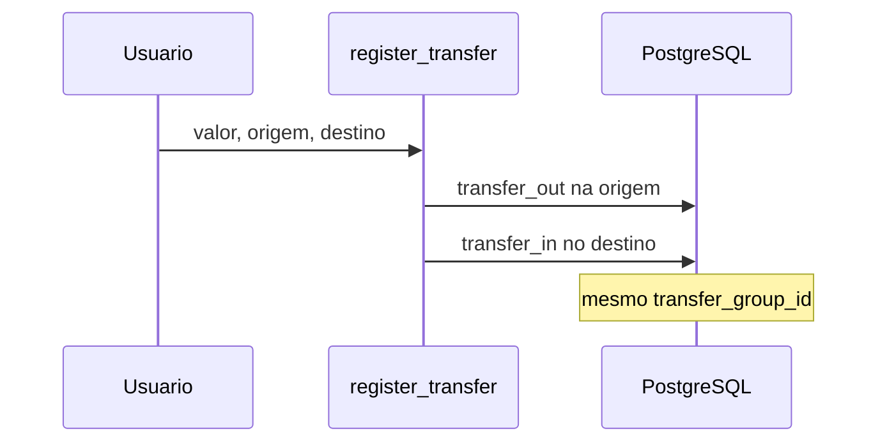

# Arquitetura — AssistFin

## Visão geral

```
┌─────────────┐     HTMX      ┌──────────────┐
│  Browser    │◄────────────►│  pages.py    │
│  (Jinja2)   │              │  auth.py     │
└─────────────┘              └──────┬───────┘
                                    │
                    ┌───────────────┼───────────────┐
                    ▼               ▼               ▼
             ┌──────────┐   ┌──────────┐   ┌──────────┐
             │ finance  │   │ runner   │   │ admin    │
             │ .py      │   │ (agent)  │   │          │
             └────┬─────┘   └────┬─────┘   └──────────┘
                  │              │
                  ▼              ▼
             ┌─────────────────────────┐
             │   PostgreSQL (app2-db)   │
             └─────────────────────────┘
                                    │
                              ┌─────▼─────┐
                              │ Groq API  │
                              │ Ollama    │
                              └───────────┘
```

## Camadas

### Apresentação

- Templates Jinja2 com Tailwind CDN
- HTMX para chat do assistente e confirmações sem reload completo
- Sidebar: Dashboard, Contas, Movimentos, Orçamentos, Admin (root)

### API / rotas

- `routers/pages.py` — HTML (dashboard, movimentos, agente)
- `routers/auth.py` — login, registro, onboarding, logout
- `routers/api.py` — JSON (`/api/health`, `/api/summary`)

### Domínio

- `services/finance.py` — única fonte de verdade para cálculos
- `schemas.py` — validação Pydantic, `ToolCall`, formatação BRL

### Agente (híbrido)

```
mensagem do usuário
  → wizard multi-movimento? 
  → wizard transferência?
  → wizard transação?
  → wizard conta / categoria?
  → exclusão pendente?
  → _resolve_intent (regras → Groq → Ollama)
  → WRITE_TOOLS → confirmação → execute_tool
```

- LLM escolhe ferramenta (JSON); Python executa e calcula
- Estado em `session` Starlette (wizards, flags)
- Histórico em `conversation_messages`

## Modelo de dados (resumo)

| Entidade | Campos relevantes |
|----------|-------------------|
| `User` | email, is_active, is_root, onboarding_completed |
| `Account` | name, account_type, opening_balance_cents, opening_balance_date |
| `Category` | name, type (expense/income), keywords |
| `Transaction` | type, amount_cents, account_id, category_id?, status (`planned`/`actual`), competence_date, due_date, payment_date, transaction_date, transfer_group_id?, counterparty_account_id?, source_planned_id? |
| `Budget` | category_id, year, month, limit_cents |
| `Conversation` / `ConversationMessage` | logs do chat |

## Fluxo de transferência



## Dashboard por período

1. `SummaryInput(period, ref_date)` define intervalo (dia/semana/mês)
2. Receitas/despesas = soma de `income`/`expense` no intervalo
3. Saldo anterior = soma dos saldos das contas no dia anterior ao período
4. Resultado final = soma dos saldos ao fim do período
5. Saldos por conta = `_account_balance_at(account, period_end)`

## Previsto vs realizado e datas

```
competence_date  → orçamentos (mês de competência)
due_date         → vencimento; previstos pendentes na projeção
payment_date     → caixa (somente actual)
transaction_date → espelho de caixa (= due ou payment)
```

- `resolve_transaction_dates()` em `finance.py` valida e normaliza as três datas.
- Realizar previsão: `realize_planned()` cria `actual` com `source_planned_id`.
- Saldos: só `status = actual` e `transaction_date <= as_of`.
- Orçamentos: despesas somadas por `competence_date`.

### Wizard de transação (slots)

Ordem em `transaction_slots.py`:

1. tipo (despesa/receita)
2. status (realizado/previsto)
3. datas — previsto: competência + vencimento; realizado: data da realização
4. valor, descrição, conta, categoria
5. confirmação (`WRITE_TOOLS`)

O LLM **não** envia `status` nem inventa datas; o runtime pergunta ao usuário.

## Isolamento multiusuário

- Todas as queries filtram por `user_id`
- Root usa `read_scope_id()` — visão **pessoal** (não global nos dashboards normais)
- Admin em `/admin` para aprovar usuários
