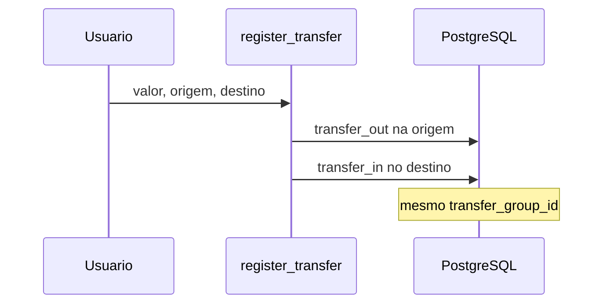
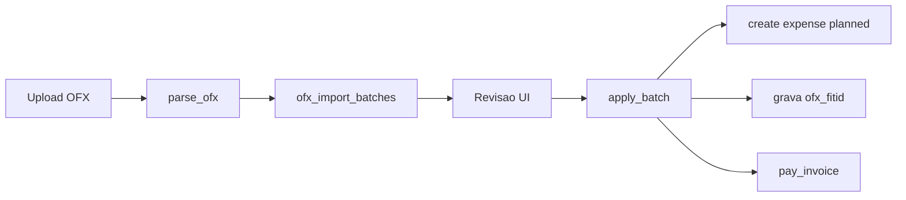

# Arquitetura — AssistFin

## Visão geral

```
┌─────────────┐     HTMX      ┌──────────────┐
│  Browser    │◄────────────►│  pages.py    │
│  (Jinja2)   │              │  auth.py     │
└─────────────┘              └──────┬───────┘
                                    │
                    ┌───────────────┼───────────────┐
                    ▼               ▼               ▼
             ┌──────────┐   ┌──────────┐   ┌──────────┐
             │ finance  │   │ runner   │   │ admin    │
             │ .py      │   │ (agent)  │   │          │
             └────┬─────┘   └────┬─────┘   └──────────┘
                  │              │
                  ▼              ▼
             ┌─────────────────────────┐
             │   PostgreSQL (app2-db)   │
             └─────────────────────────┘
                                    │
                              ┌─────▼─────┐
                              │ Groq API  │
                              └───────────┘
```

## Camadas

### Apresentação

- Templates Jinja2 com Tailwind CDN
- HTMX para chat do assistente e confirmações sem reload completo
- Chat: avatares, balões assimétricos, chips/confirmação fora do balão; filtro `chat_md` (`app/chat_format.py`) para `*negrito*` e listas
- Sidebar: Dashboard, Contas, Cartões, Movimentos, Orçamentos, Admin (root)
- **CRUD** nas entidades: lista + páginas `/new` e `/{id}/edit` (movimentos, contas, cartões, orçamentos)
- **Movimentos** (`/transactions`): filtro de período (padrão mês); **A realizar** / **Extrato**; sem formulário lateral
- **Cartões** (`/accounts/cards`): cartão expansível → faturas → movimentos; **Importar OFX** com tela de revisão

### API / rotas

- `routers/pages.py` — HTML (dashboard, movimentos, agente)
- `routers/auth.py` — login, registro, onboarding, logout
- `routers/api.py` — JSON (`/api/health`, `/api/summary`)

### Domínio

- `services/finance.py` — única fonte de verdade para cálculos
- `services/credit_cards.py` — ciclo de faturas, limite, pagamento
- `services/ofx_card_import.py` — importação OFX (parse, matching, revisão, apply)
- `services/recurrence.py` — regras fixas e horizonte de previstos
- `services/installments.py` — planos parcelados (`split_cents` / `repeat_cents`)
- `schemas.py` — validação Pydantic, `ToolCall`, formatação BRL

### Agente (híbrido)

```
mensagem do usuário
  → multi-movimento em andamento (pending_movements)?
  → wizard pagar fatura?
  → wizard transferência?
  → wizard realizar previsto?
  → wizard transação? (slots de data/modo/parcelas/recorrência têm prioridade sobre multi-lançamento)
  → try_begin_from_message (nova mensagem com vários valores)?
  → wizard cartão? (cadastro em andamento)
  → wizard conta / categoria?
  → exclusão pendente?
  → _resolve_intent:
       atalhos de regra (realize_planned, pay_invoice, register_expense, register_income)
       → Groq
       → try_rule_based_parse (fallback)
  → WRITE_TOOLS → confirmação → execute_tool
```

- LLM escolhe ferramenta (JSON); Python executa e calcula
- Após `register_expense` / `register_income` / `realize_planned`, `format_tool_result` anexa resumo de fatura ou conta (`context_summary`)
- Estado em `session` Starlette (wizards, flags)
- Histórico em `conversation_messages`

## Modelo de dados (resumo)

| Entidade | Campos relevantes |
|----------|-------------------|
| `User` | email, is_active, is_root, onboarding_completed |
| `Account` | name, account_type (`corrente`/`poupanca`/`carteira`), opening_balance_cents, opening_balance_date |
| `CreditCard` | name, institution, credit_limit_cents, closing_day, due_day, settlement_account_id, is_active |
| `CardInvoice` | card_id, cycle_start, cycle_end, due_date, status (`open`/`closed`/`paid`) |
| `Category` | name, type (expense/income), keywords |
| `Transaction` | type, amount_cents, account_id?, card_id?, invoice_id?, ofx_fitid?, category_id?, status (`planned`/`actual`), competence_date, due_date, payment_date, transaction_date, transfer_group_id?, counterparty_account_id?, source_planned_id?, recurrence_id?, installment_plan_id?, installment_index? |
| `OfxImportBatch` | user_id, card_id, filename, status (`pending`/`applied`/`cancelled`) — staging da revisão OFX |
| `OfxImportLine` | batch_id, fitid, posted_date, amount_cents, direction, memo, suggested_*/chosen_* actions |
| `RecurringRule` | user_id, account_id, category_id, type, amount_cents, description, frequency (`daily`/`weekly`/`monthly`), start_date, end_date?, is_active, anchor_day, anchor_weekday |
| `InstallmentPlan` | user_id, account_id, category_id?, type, total_cents, installment_count, interval (`monthly`/`weekly`/`biweekly`), start_date, description, is_active |
| `Budget` | category_id, year, month, limit_cents |
| `Conversation` / `ConversationMessage` | logs do chat |

## Fluxo de transferência



## Dashboard por período

1. `SummaryInput(period, ref_date)` define intervalo (dia/semana/mês)
2. Receitas/despesas = soma de `income`/`expense` no intervalo
3. Saldo anterior = soma dos saldos das contas no dia anterior ao período
4. Resultado final = soma dos saldos ao fim do período
5. Saldos por conta = `_account_balance_at(account, period_end)`
6. Faturas = `invoice_dashboard()` em `credit_cards.py` (`summary["card_invoices"]`): total em aberto, fatura atual por cartão, vencimento no período, limite disponível. **Não** entra no saldo das contas.

## Previsto vs realizado e datas

```
competence_date  → orçamentos (mês de competência)
due_date         → vencimento; previstos pendentes na projeção
payment_date     → caixa (somente actual)
transaction_date → espelho de caixa (= due ou payment)
```

- `resolve_transaction_dates()` em `finance.py` valida e normaliza as três datas.
- Realizar previsão: `realize_planned()` cria `actual` com `source_planned_id`; o previsto permanece no banco para o dashboard. Se a conta informada difere, atualiza `planned.account_id`. Com `recurrence_id`, reabastece o horizonte após a realização.
- Saldos: só `status = actual` e `transaction_date <= as_of`.
- Orçamentos: despesas somadas por `competence_date`.
- `list_transactions()` aceita filtro opcional `status` (`actual` | `planned` | `all`, default `all`) em `ListTransactionsInput`.

### Página Movimentos vs dashboard

| Onde | O que mostra |
|------|----------------|
| **A realizar** | `status = planned` e ainda sem realização (`is_realized = false`) |
| **Extrato** | Somente `status = actual` no período (omite `transfer_in` e compras de cartão) |
| **Filtro** | `period` + `ref_date` (padrão month); mesma lógica do dashboard |
| **Dashboard** | Previstos do período, pendentes, projeção, **previsto vs realizado**, **por categoria**, faturas |

Previstos já liquidados **não** aparecem na lista de Movimentos (evita duplicata com o lançamento realizado). O par previsto/realizado continua disponível no dashboard.

Consultas da página usam duas chamadas: `ListTransactionsInput(status="planned")` e `ListTransactionsInput(status="actual")`, para que um extrato longo não oculte previsões pendentes.

### Formulário CRUD de movimentos (`/transactions/new`, `/{id}/edit`)

- **Realizado** (padrão): um campo “Data da realização”; competência e vencimento são replicados no backend.
- **Previsto** (checkbox): competência + vencimento; sem data de pagamento.
- **Realizar** (ação na linha da lista): data de pagamento obrigatória; valor e descrição opcionais; mesma conta ou outra.
- **Lançamento fixo** (checkbox): frequência diária/semanal/mensal e data de término opcional; cria regra em `recurring_rules` e previstos até o horizonte.
- **Parcelado** (checkbox, exclusivo com fixo): N parcelas, intervalo, radios **total da compra** / **valor de cada parcela**. O formulário cria da parcela 1; o wizard pergunta `installment_start_index`.
- **Editar** (`/{id}/edit`): tipo Despesa/Receita alterável; se parcelado com parcelas seguintes, radio de escopo obrigatório.
- **Encerrar série** / **Cancelar parcelas**: na lista **A realizar**.
- **Transferência**: sempre realizada; uma data de realização.
- Lista `/transactions`: filtro de período (padrão mês); extrato omite `transfer_in`.

### Wizard de transação (slots)

Ordem em `transaction_slots.py` (depende de status e modo):

| Contexto | Sequência |
|----------|-----------|
| **Previsto**, não parcelado | tipo → status → competência → vencimento → modo → (recorrência se fixo) → valor → … |
| **Realizado**, não parcelado | tipo → status → modo (se indefinido) → pagamento → (recorrência se fixo) → valor → … |
| **Parcelado** | … → N → intervalo → parcela atual (`installment_start_index`) → competência + vencimento da parcela → pagamento (se realizado) → valor → total vs parcela → descrição → conta → categoria |

O LLM **não** envia `status`, `installment_amount_basis` nem `installment_start_index`; não inventa datas de parcelamento.

### Lançamentos fixos (recorrência)

```
recurring_rules  --ensure_horizon-->  transactions (planned)
transactions (planned)  --realize_planned-->  transactions (actual)
```

- Motor em `services/recurrence.py`: `next_occurrence`, `horizon_end` (hoje + 3 meses), `ensure_recurring_horizon`, `deactivate_recurring_rule`.
- Ao cadastrar com frequência, a primeira ocorrência segue o `status` informado; as demais são sempre `planned`.
- Unique `(recurrence_id, due_date)` evita duplicatas ao reabastecer o horizonte.
- `ensure_recurring_horizon` roda na criação da regra, no dashboard/Movimentos e após `realize_planned` com `recurrence_id`.
- Transferências **não** suportam recorrência no MVP.
- Resposta no slot `payment_mode` ou recorrência/parcelas não cancela o wizard (exceção a `CANCEL_WORDS` em `agent_state.py`).

### Lançamentos parcelados

```
installment_plans  --create_installment_plan(start_index?)-->  transactions (parcelas start_index..N)
transactions (planned)  --realize_planned-->  transactions (actual)
```

- Motor em `services/installments.py`: `split_cents`, `repeat_cents`, `due_date_for_index`, `create_installment_plan`, `cancel_installment_plan`.
- Valor: `amount_basis=total` (divide) ou `installment` (repete). Wizard + formulário: `installment_amount_basis`.
- Parcela inicial: `installment_start_index` (1…N); plano mantém `installment_count` total; só persiste transações da parcela informada em diante.
- Wizard (parcelado), após modo: `installment_count` → `installment_interval` → `installment_start_index` → `competence_date` → `due_date` → (`payment_date` se realizado) → `amount` → `installment_amount_basis` → descrição → conta → categoria.
- Datas no parcelamento: `apply_inferred_dates` não preenche slots; escolher *parcelado* limpa datas genéricas; `payment_date` não sobrescreve competência/vencimento; cronograma usa `due_date` como `start_date` do plano.
- Confirmação (`format_pending_confirmation`): competência, vencimento e realização exibidos separadamente quando há parcelas.
- Mutuamente exclusivo com `frequency` (fixo). Transferências **não** parcelam no MVP.
- Unique `(installment_plan_id, installment_index)`.
- **Editar parcela**: `installment_scope` (`this` \| `subsequent`); UI e `installment_scope_flow.py` perguntam quando há parcelas com índice maior.

### Multi-lançamentos vs slots de data

Mensagens com **vários valores monetários** (ex.: "gastei 54 de passagem e 30 de recarga") podem abrir o fluxo `multi_movement_flow` (`parse_multi_movements`).

**Não** entram nesse fluxo:

- Respostas de **data isolada** no wizard (`10/08/2026`, `hoje`, `agosto`) — `is_date_only_message()` em `tools.py`
- Wizard ativo aguardando `competence_date`, `due_date`, `payment_date`, `payment_mode`, slots de recorrência (`frequency`, `recurrence_end_date`) ou parcelas (`installment_count`, `installment_interval`, `installment_start_index`, `installment_amount_basis`) — `try_begin_from_message` retorna `None`
- Narrativas com palavras de despesa/receita e múltiplos valores (ex.: "Ontem tive as despesas de 54...")

Ordem no `runner.py`: wizard de transação processa a mensagem **antes** de tentar iniciar multi-lançamento.

### Wizard de realizar previsto

Arquivo: `realize_planned_slots.py`. Ordem:

1. identificar previsto (`planned_id` ou descrição)
2. data de pagamento
3. mesma conta do previsto? (sim/não)
4. conta (se outra)
5. confirmação (`realize_planned`)

Processado no `runner.py` **antes** do wizard de transação genérico.

### Cartões de crédito

Entidade `CreditCard` separada de contas bancárias (migração `016`). Transações referenciam `card_id` e/ou `account_id`.

```
credit_cards  --ensure_invoices-->  card_invoices
transactions (card_id + invoice_id)  --compra-->  fatura aberta
pay_invoice  --despesa na conta de débito-->  card_invoices.status = paid
```

- Motor em `services/credit_cards.py` e `finance.create_card` / `update_card` / `deactivate_card`.
- Assistente: `create_card` (wizard `card_wizard.py`), `update_card`, `delete_card`, `list_invoices`, `pay_invoice` (wizard `pay_invoice_slots.py`).
- Compras no cartão **não** alteram saldo bancário; pagamento da fatura não duplica despesa da compra.

### Importação OFX (cartão)

Migração `017`: `transactions.ofx_fitid` + staging `ofx_import_batches` / `ofx_import_lines`.



- Serviço: `services/ofx_card_import.py` (parser SGML/XML leve, sem lib externa).
- UI: `/accounts/cards/{id}/ofx` → revisão → aplicar/cancelar (CSRF).
- Débito: `create` ou `match` (mesmo cartão, valor igual, data ±3 dias, similaridade de memo).
- Crédito: `pay_invoice` / `link_invoice_payment` se valor ≈ fatura; senão `skip`.
- Idempotência: FITID já presente → `already_imported`. Lotes `pending` expiram em 24h.
- Fora de escopo v1: OFX de conta corrente, agente/chat, estornos parciais automáticos.

### Corrigir transferência

`update_transfer` altera o par `transfer_out`/`transfer_in` (origem, destino, valor, datas). Identifica pelo `transaction_id` ou pelo valor. **Não** usar `update_transaction` (só despesa/receita) nem criar outra transferência.

### Editar despesa/receita e parcelas

`update_transaction` aceita `type` (expense↔income) e, em parcelamentos com parcelas seguintes, `installment_scope`:

| Escopo | Efeito |
|--------|--------|
| `this` | Só a parcela editada |
| `subsequent` | Parcela atual e todas com `installment_index` maior |

Valor, descrição, conta, categoria e tipo podem propagar; datas ficam só na parcela editada. Na UI (`transaction_edit.html`) e no assistente (`installment_scope_flow.py`) a escolha é obrigatória quando há parcelas seguintes.

### Categorias no assistente

- `list_categories`, `create_category` (wizard; lote via `names`; “Vale e Auxílio” = um nome), `update_category`, `delete_category`
- Nome único por usuário: criar com outro tipo **atualiza** o tipo existente

### Visual do chat

| Peça | Arquivo |
|------|---------|
| Filtro `chat_md` | `app/chat_format.py` (HTML escapado; `*negrito*`/`**negrito**`; listas `- `) |
| Avatar | `partials/agent_avatar.html` |
| Corpo da mensagem | `partials/agent_message_body.html` |
| Chips | `partials/agent_suggestions.html` (fora do balão; Cancelar distinto) |
| Confirmar / Cancelar | `partials/agent_confirm_actions.html` (fora do balão) |

## Isolamento multiusuário

- Todas as queries filtram por `user_id`
- Root usa `read_scope_id()` — visão **pessoal** (não global nos dashboards normais)
- Admin em `/admin` para aprovar usuários e fazer backup/restauração do banco
